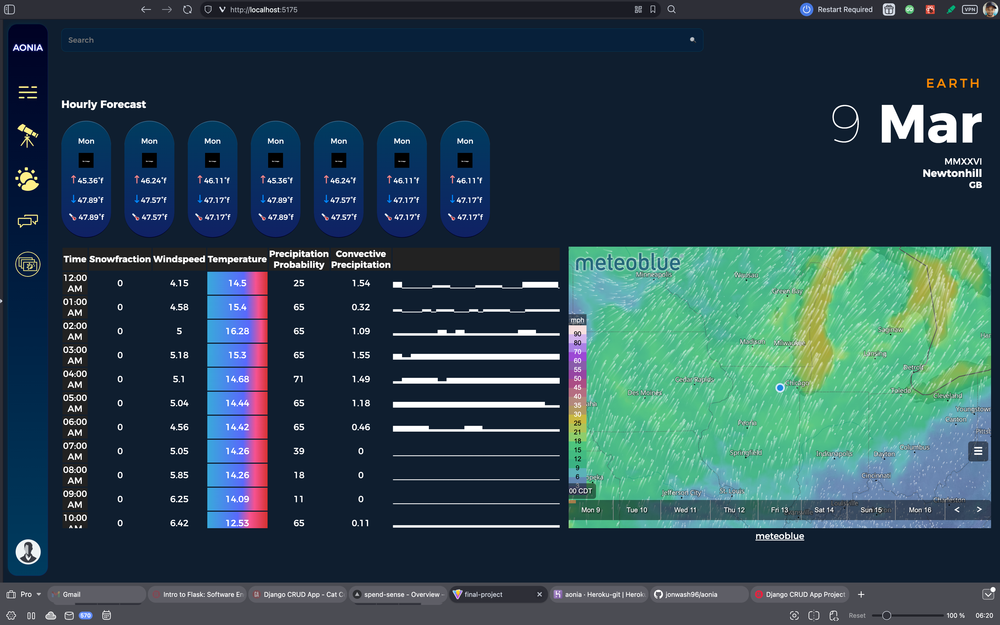

# A O N I A  API

version 0.1.0
[Web-App Live on Vercel] link loading. . .
[Check out the Web-App Repository] link loading. . .

Aonia is an app for astrophotographers, implementing various tools to assist in the art, as well as a community and chat feature, enabling collaboration and fostering community.

Version 0.1.0 features hourly weather info and a map, to keep you informed about current conditions, and scope out the best spots.

## Information & Technology
Aonia is a MERN stack app with a RESTful API back end. Several API's are implemented into version 0.1.0, and several more are being implemented to provide the best user experience possible.

## Getting Started
Click the link to visit the url. Once there, You can sign up for an acount. Make sure to follow the guidelines for creating a valid user account. Once you're authorized, you can view the app. The app does not authenticate emails at this time, so if you'd like to stay informed about updates in its development, please return here to follow the project, or contact the developer for more information.

For the curious minds, It's a mountain on Mars, named after an ancient Greek City known for its Muses.